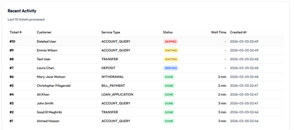
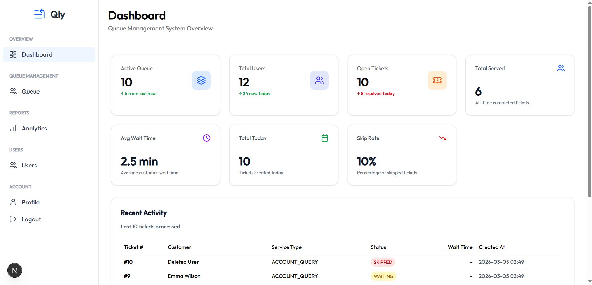
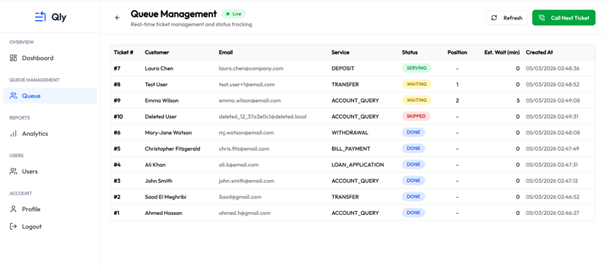
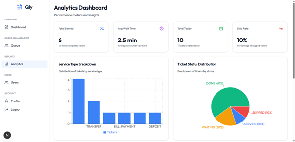
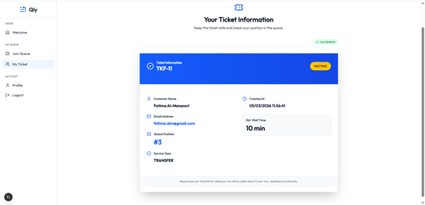

# 🎫 Smart Queue Management System

A full-stack queue management system with real-time updates and analytics.

## 🚀 Features

- 🔐 JWT Authentication (Admin/Customer roles)
- 🎫 FIFO Queue Management
- ⚡ Real-Time WebSocket Updates
- 📊 Analytics Dashboard
- 👥 User Management

## 🛠️ Tech Stack

**Backend:** Spring Boot, MySQL, WebSocket, JWT  
**Frontend:** Next.js, TypeScript, Tailwind CSS, Recharts

## 📸 Screenshots

### Admin Dashboard



### Queue Management


### Analytics



### Customer Ticket View


## 🚀 Quick Start

### Backend
```bash
cd backend
mvn spring-boot:run
# Runs on http://localhost:8084
```

### Frontend
```bash
cd frontend
npm install
npm run dev
# Runs on http://localhost:3000
```
### Docker

mvn clean package -DskipTests
docker-compose down -v
docker-compose up --build

## 📝 Default Login

**Admin:**  
Email: `admin@example.com`  
Password: `admin123`

**Customer:**  
Email: `customer@example.com`  
Password: `customer123`

## 📂 Project Structure
```
smart-queue-management/
├── backend/          # Spring Boot API
└── frontend/         # Next.js App
```

## 📄 License

MIT License
